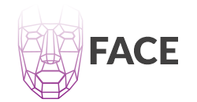

<p align="center"></p>

<p align="center">
    <a href="https://circleci.com/gh/eduardostuart/face">
        
    </a>
    <a href="https://styleci.io/repos/95909712">
        
    </a>
    
    
</p>

## Introduction


## Table of contents


1. [Installation](#installation)
1. [Configuration](#configuration)
1. [How to use](#how-to-use)
   1. [Detect api](#detect)
   1. [Albums](#albums)
      1. [Create](#create-album)
      2. [Update](#update-album)
      3. [Delete](#delete-album)
      4. [Get all albums](#get-all-albums)
      5. [Get an album](#get-an-album)
      4. [Add face into an album](#add-face-into-an-album)
      5. [Remove face from album](#remove-face-from-album)
   1. [Search](#search)
   2. [Get a Face](#get-a-face)
1. [License](#license)
1. [Security](#security)

## Installation

To get the latest version, require the project using composer:

```bash
composer require eduardostuart/face
```

Once installed, you need to register the `Face Service provider` in your `config/app.php`.

```php
return [
    // ....
    Face\FaceServiceProvider::class,
]
```

And add Face Facade into config/app.php.

```php
return [
    // ....
    'Face' => Face\Facades\Face::class,
]
```

## Configuration

To start using Laravel Face, you need to publish `Face` configuration file.

```php
php artisan vendor:publish --provider="Face\FaceServiceProvider"
```

You also need to add credentials (or custom settings) for services that your application utilizes. These informations should be placed in `config/face.php` file.


## How to use

### Detect

Detect and analyzes human faces.

```php
// ...
use Face;

$results = Face::detect('https://.../photo.jpg');
```

## Albums

### Create album

```php
// ...
use Face;

$album = Face::createAlbum("my album name", [
    "face-id-1", "face-id-2", 
]);

// $album->getName();
// $album->getTags();
// $album->getFaces();
// $album->toJson();
// $album->toArray();
```

### Remove album

```php
// ...
use Face;

if(Face::removeAlbum("album-id")){
    echo "OK!";
}
```

### Update album

```php
// ...
use Face;

$albumUpdated = Face::updateAlbum("album-id", "new album name");
```

### Get all albums

```php
// ...
use Face;

$albums = Face::albums();
print_r($albums->toArray());
```

### Get an album

```php
// ...
use Face;

$album = Face::album("album-id");
echo $album->getName();
```


### Add face into an album

```php
// ...
use Face;

if(Face::addIntoAlbum("album-id", ["face-1-id","face-2-id"])){
    echo "Added!";
}
```

### Remove face from album

```php
// ...
use Face;

if(Face::removeFaceFromAlbum("album-id", ["face-1-id","face-2-id"])){
    echo "Removed!";
}
```

### Search

Find one or more similar faces.


```php
// ...
use Face;

$albumId = '1234';

$result = Face::search($albumId, 'https://.../photo.jpg');

// $result->getTotal();
// $result->getResults();
```

### Get a Face

```php
// ...
use Face;

$result = Face::getFace('face-id');

// $result->getAttributes();
// $result->getId();
// $result->getReference();
```

## Providers

- [x] [Face++](https://faceplusplus.com)
- [ ] [Lambda Labs](https://lambdal.com/face-recognition-api)
- [ ] [Sky Biometry](https://skybiometry.com)
- [ ] [Kairos](https://kairos.com)
- [ ] [Microsoft](https://azure.microsoft.com/en-us/try/cognitive-services/?api=computer-vision)

## License

Face is open-sourced software licensed under the [MIT license](http://opensource.org/licenses/MIT)

## Security

If you discover a security vulnerability within this package, please send an e-mail to Eduardo Stuart at hi@s.tuart.me. All security vulnerabilities will be promptly addressed.
